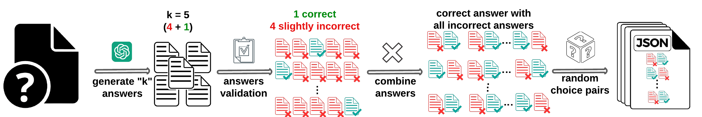

# GeneratePairs

This repository contains pipelines for generating **preference pairs** (A/B testing data) used for **evaluating LLM-as-a-Judge systems**.

The goal is to create datasets where two responses are compared: a **correct reference solution** versus a **subtly incorrect mutant/distractor**. The main challenge for the Judge Model is to correctly identify the subtle error that differentiates the two options.

## 🚀 Pipeline Overview

Although the data formatting differs between coding problems and multiple-choice questions, the **essence of the pipeline remains the same**: ensuring high-quality preference data. We rigorously validate the "correct" answer and generate plausible "incorrect" answers (distractors/mutants) to create a difficult discrimination task for the Judge.

### 1. Code Pipeline (`judgebench-pipeline`)
*   **Domain**: Programming (Java).
*   **Method**: Uses an LLM to generate "mutants" (subtly buggy versions) of a reference solution.
*   **Validation**: Runs actual test cases. Only mutants that *fail* tests are kept as "incorrect" responses.
*   **Output**: Pairs of (Correct Solution vs. Buggy Solution).

### 2. Multiple Choice Pipelines (`mathematics`, `knowledge`, `reasoning`)
*   **Domains**: Math, General Knowledge, Logical Reasoning.
*   **Method**: Uses validation to ensure the ground truth is correct and generates/selects challenging distractors.
*   **Output**: Pairs of (Correct Option vs. Incorrect Distractor).

## 📂 Directory Structure

*   **`judgebench-pipeline/`**: The Python pipeline for generating code-based preference pairs.
*   **`mathematics/`**: Pipeline and data for math questions.
*   **`knowledge/`**: Pipeline and data for knowledge-based questions.
*   **`reasoning/`**: Pipeline and data for reasoning questions.
*   **`pairs_all_tasks/`**: 📁 **Final Output**. This folder contains the generated preference pairs for **all** tasks (Code, Math, Knowledge, Reasoning).
*   **`image/`**: Contains visual assets for documentation.

## 🏁 Getting Started

To run the code generation pipeline, navigate to `judgebench-pipeline/` and follow the instructions in its [README](judgebench-pipeline/README.md).
